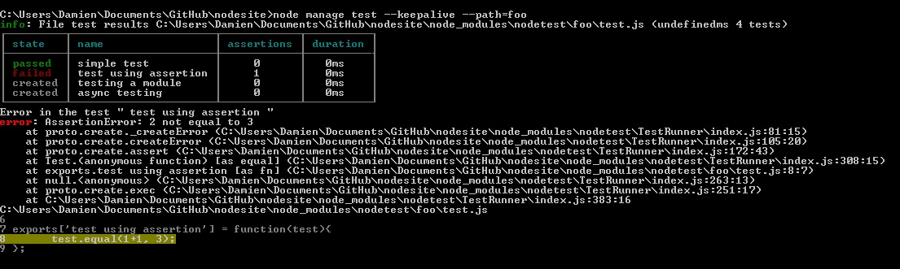

# nodetest

Unit tests your node modules.

## Example

This example shows the result of unit testing [foo/test.js](./foo/test.js)



## Module tests structure

The following directory structure shows which test file will be runned.

```
node_modules/
	foo/
		index.js
		test.js <- test file for foo/index.js
	bar/
		index.js
		dependency.js
		test.js <- test file for bar/index.js
		test-dependency.js <- test file for bar/dependency.js
	boo/
		main.js
		package.json // {"main": 'main.js'}
		test.js <- test file for boo/main.js
	bat/
		index.js
		test.js <- ignored because there is a test folder
		test/
			test.js <- test file for bat/index.js
```